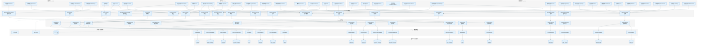

```mermaid
%%{init: {'theme':'base', 'themeVariables': {'background':'#ffffff', 'primaryColor':'#e3f2fd', 'primaryBorderColor':'#1976d2', 'lineColor':'#546e7a', 'tertiaryColor':'#f5f5f5'}}}%%
graph TB

    %% ===== 用户端 =====
    subgraph 用户端Frontend [ 用户端 Frontend]
        direction TB
        UF1[登录/注册]
        UF2[首页 Home]
        UF3[商品列表 Products]
        UF4[商品详情 ProductDetail]
        UF5[购物车 Cart]
        UF6[确认订单 CheckoutDialog]
        UF7[我的订单 MyOrders]
        UF8[订单详情 OrderDetail]
        UF9[物流跟踪 LogisticsDialog]
        UF10[我的收藏 Favorites]
        UF11[我的优惠券 MyCoupons]
        UF12[领券中心 Coupons]
        UF13[个人信息 UserPerson]
        UF14[公告 News]
        UF15[公告详情 NewsDetail]
    end

    %% ===== 商家端 =====
    subgraph 商家端Frontend [🏪 商家端 Frontend]
        direction LR
        MF1[仪表盘 Dashboard]
        MF2[我的商品 MyProducts]
        MF3[发布商品 PublishProduct]
        MF4[订单管理 OrderManage]
    end

    %% ===== 管理端 =====
    subgraph 管理端Frontend [⚙️ 管理端 Frontend]
        direction LR
        AF1[管理首页 Home]
        AF2[用户管理 User]
        AF3[商品管理 Products]
        AF4[待审核商品 PendingProducts]
        AF5[商品评价 ProductReview]
        AF6[优惠券管理 CouponManage]
        AF7[商家管理 Merchant]
        AF8[登录历史 LoginHistory]
        AF9[日志管理 LogManage]
        AF10[公告管理 Notice]
        AF11[数据备份 DataBackup]
        AF12[系统日志 Log]
        AF13[数据统计 Statistics]
        AF14[性能监控 Performance]
        AF15[服务器状态 ServerStatus]
        AF16[系统设置 Settings]
        AF17[管理员信息 AdminPerson]
    end

    %% ===== Controller 层 =====
    subgraph Controller [Controller 控制层]
        direction LR
        CT_Auth[AuthController<br/>认证]
        CT_User[UserController<br/>用户]
        CT_Product[ProductController<br/>商品]
        CT_Order[OrderController<br/>订单]
        CT_Cart[CartController<br/>购物车]
        CT_Address[AddressController<br/>地址]
        CT_Coupon[CouponController<br/>优惠券]
        CT_Delivery[DeliveryController<br/>物流]
        CT_AfterSales[AfterSalesController<br/>售后]
        CT_Review[ReviewController<br/>评价]
        CT_Favorite[FavoriteController<br/>收藏]
        CT_News[NewsController<br/>公告]
        CT_Merchant[MerchantController<br/>商家]
        CT_MerchantOrder[MerchantOrderController<br/>商家订单]
        CT_MerchantProduct[MerchantProductController<br/>商家商品]
        CT_System[SystemController<br/>系统]
        CT_File[FileController<br/>文件]
        CT_LoginHistory[LoginHistoryController<br/>登录历史]
        CT_UserCoupon[UserCouponController<br/>用户优惠券]
    end

    %% ===== Service 层 =====
    subgraph Service [Service 服务层]
        direction LR
        SV_User[UserService<br/>用户服务]
        SV_Product[ProductService<br/>商品服务]
        SV_Order[OrderService<br/>订单服务]
        SV_Cart[CartService<br/>购物车服务]
        SV_Address[AddressService<br/>地址服务]
        SV_Coupon[CouponService<br/>优惠券服务]
        SV_Delivery[DeliveryService<br/>物流服务]
        SV_AfterSales[AfterSalesService<br/>售后服务]
        SV_Review[ReviewService<br/>评价服务]
        SV_Favorite[FavoriteService<br/>收藏服务]
        SV_News[NewsService<br/>公告服务]
        SV_Merchant[MerchantService<br/>商家服务]
        SV_LoginHistory[LoginHistoryService<br/>登录历史]
        SV_System[SystemService<br/>系统服务]
        SV_UserCoupon[UserCouponService<br/>用户优惠券]
    end

    %% ===== Mapper 层 =====
    subgraph Mapper [Mapper 数据访问层]
        direction LR
        MP_User[UserMapper]
        MP_Product[ProductMapper]
        MP_Order[OrderMapper]
        MP_OrderProduct[OrderProductMapper]
        MP_Cart[CartMapper]
        MP_Address[AddressMapper]
        MP_Coupon[CouponMapper]
        MP_UserCoupon[UserCouponMapper]
        MP_Delivery[DeliveryMapper]
        MP_DeliveryTracking[DeliveryTrackingMapper]
        MP_AfterSales[AfterSalesMapper]
        MP_Review[ProductReviewMapper]
        MP_Favorite[FavoriteMapper]
        MP_News[NewsMapper]
        MP_Merchant[MerchantMapper]
        MP_LoginHistory[LoginHistoryMapper]
        MP_SystemLog[SystemLogMapper]
        MP_Backup[BackupMapper]
        MP_ProductImage[ProductImageMapper]
    end

    %% ===== 数据库 =====
    subgraph Database [🗄️ MySQL 数据库]
        direction LR
        DB_User[(users)]
        DB_Product[(products)]
        DB_ProductImage[(product_images)]
        DB_Order[(orders)]
        DB_OrderProduct[(order_products)]
        DB_Cart[(cart)]
        DB_Address[(addresses)]
        DB_Coupon[(coupons)]
        DB_UserCoupon[(user_coupons)]
        DB_Delivery[(deliveries)]
        DB_DeliveryTracking[(delivery_tracking)]
        DB_AfterSales[(after_sales)]
        DB_Review[(product_reviews)]
        DB_Favorite[(favorites)]
        DB_News[(news)]
        DB_Merchant[(merchants)]
        DB_LoginHistory[(login_history)]
        DB_SystemLog[(system_logs)]
        DB_Backup[(backups)]
    end

    %% ===== 中间件 =====
    subgraph 中间件 [中间件/外部服务]
        Redis[(Redis 缓存)]
        OSS[文件存储]
        JWT[JWT Token]
    end

    %% ===== 前端→Controller =====
    用户端Frontend --- Controller
    商家端Frontend --- Controller
    管理端Frontend --- Controller

    UF1 --> CT_Auth
    UF2 --> CT_Product & CT_News
    UF3 --> CT_Product
    UF4 --> CT_Product & CT_Review & CT_Favorite
    UF5 --> CT_Cart
    UF6 --> CT_Order & CT_Address & CT_UserCoupon
    UF7 --> CT_Order
    UF8 --> CT_Order & CT_AfterSales
    UF9 --> CT_Delivery
    UF10 --> CT_Favorite
    UF11 --> CT_UserCoupon
    UF12 --> CT_Coupon
    UF13 --> CT_User & CT_Address
    UF14 --> CT_News
    UF15 --> CT_News

    MF1 --> CT_MerchantOrder
    MF2 --> CT_MerchantProduct
    MF3 --> CT_MerchantProduct & CT_File
    MF4 --> CT_MerchantOrder

    AF1 --> CT_System
    AF2 --> CT_User
    AF3 --> CT_Product
    AF4 --> CT_MerchantProduct
    AF5 --> CT_Review
    AF6 --> CT_Coupon & CT_UserCoupon
    AF7 --> CT_Merchant
    AF8 --> CT_LoginHistory
    AF9 --> CT_System
    AF10 --> CT_News
    AF11 --> CT_System
    AF12 --> CT_System
    AF13 --> CT_System
    AF14 --> CT_System
    AF15 --> CT_System
    AF16 --> CT_System
    AF17 --> CT_User

    %% ===== Controller→Service =====
    CT_Auth --> SV_User
    CT_User --> SV_User
    CT_Product --> SV_Product
    CT_Order --> SV_Order
    CT_Cart --> SV_Cart
    CT_Address --> SV_Address
    CT_Coupon --> SV_Coupon
    CT_Delivery --> SV_Delivery
    CT_AfterSales --> SV_AfterSales
    CT_Review --> SV_Review
    CT_Favorite --> SV_Favorite
    CT_News --> SV_News
    CT_Merchant --> SV_Merchant
    CT_MerchantOrder --> SV_Order
    CT_MerchantProduct --> SV_Product
    CT_System --> SV_System
    CT_LoginHistory --> SV_LoginHistory
    CT_UserCoupon --> SV_UserCoupon

    %% ===== Service→Mapper =====
    SV_User --> MP_User
    SV_Product --> MP_Product & MP_ProductImage
    SV_Order --> MP_Order & MP_OrderProduct
    SV_Cart --> MP_Cart
    SV_Address --> MP_Address
    SV_Coupon --> MP_Coupon
    SV_Delivery --> MP_Delivery & MP_DeliveryTracking
    SV_AfterSales --> MP_AfterSales
    SV_Review --> MP_Review
    SV_Favorite --> MP_Favorite
    SV_News --> MP_News
    SV_Merchant --> MP_Merchant
    SV_LoginHistory --> MP_LoginHistory
    SV_System --> MP_SystemLog & MP_Backup
    SV_UserCoupon --> MP_UserCoupon

    %% ===== Mapper→Database =====
    MP_User --> DB_User
    MP_Product --> DB_Product
    MP_ProductImage --> DB_ProductImage
    MP_Order --> DB_Order
    MP_OrderProduct --> DB_OrderProduct
    MP_Cart --> DB_Cart
    MP_Address --> DB_Address
    MP_Coupon --> DB_Coupon
    MP_UserCoupon --> DB_UserCoupon
    MP_Delivery --> DB_Delivery
    MP_DeliveryTracking --> DB_DeliveryTracking
    MP_AfterSales --> DB_AfterSales
    MP_Review --> DB_Review
    MP_Favorite --> DB_Favorite
    MP_News --> DB_News
    MP_Merchant --> DB_Merchant
    MP_LoginHistory --> DB_LoginHistory
    MP_SystemLog --> DB_SystemLog
    MP_Backup --> DB_Backup

    %% ===== 中间件依赖 =====
    SV_Product -.-> Redis
    SV_User -.-> Redis
    CT_File -.-> OSS
    CT_Auth -.-> JWT
```
